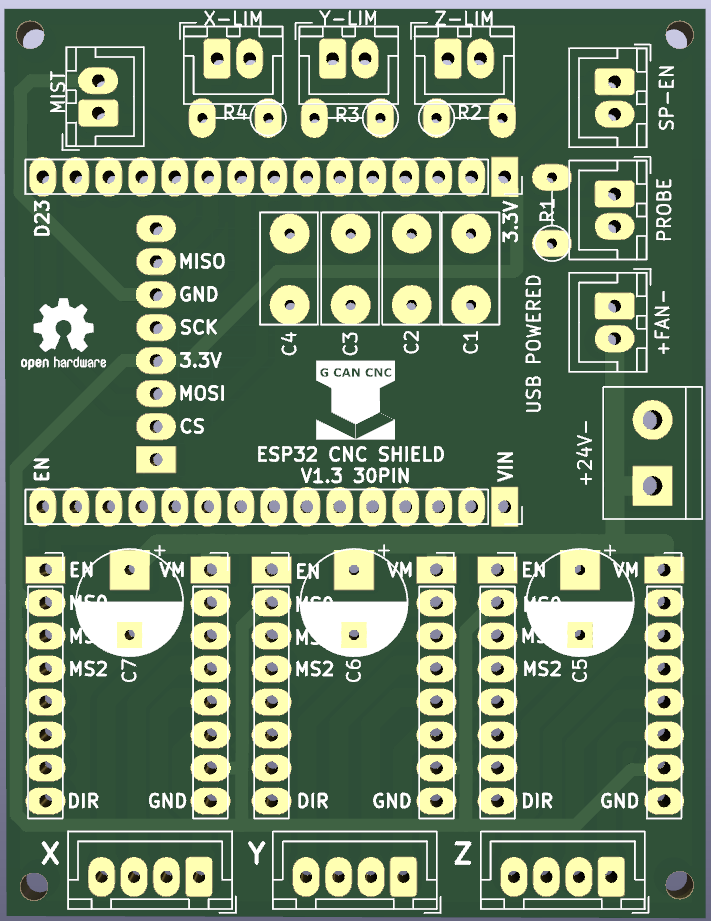

# -ESP32_CNC_SHIELD_V1.3_30PIN
New version of  ESP32 CNC SHIELD V1.3 30PIN

For this version i ordered the boards, made some changes: JST connectors and component emplacement.

I created a solder Kit, wich includes:

PCB board (54x70)

Capacitors:

    C1-4 100nF ceramic
    
    C5-7 33uF electrolitic

Resistors:

    R1-4 100 Ohm

Connectors:

    1 Screwterminal
    
    2 PinSockets 15x1
    
    6 Pinsockets 8x1
    
    3 JST Feamale 4x1
    
    7 JST Feamale 2x1
    
    So you can build your own cables
    
    3 JST Male 4x1
    
    7 JST Male 2x1
    
    30 Crimp terminals
    
    

You can find it on eBay soon.

If you want another configuration, don`t hesitate to contact me.
